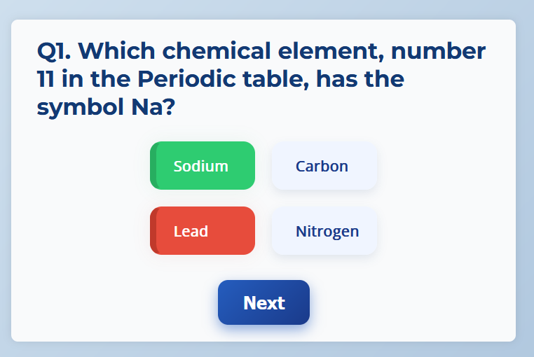
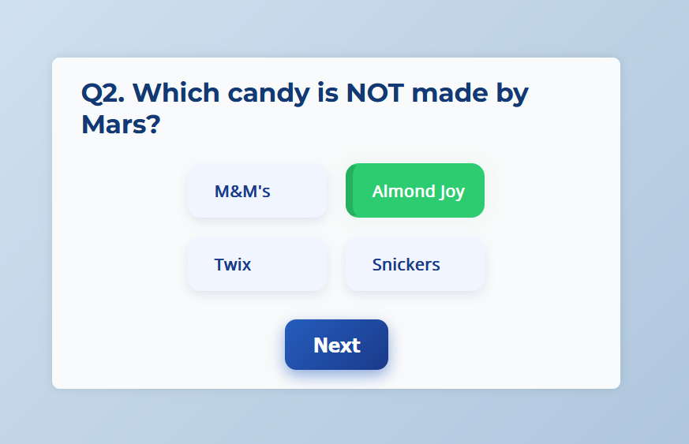
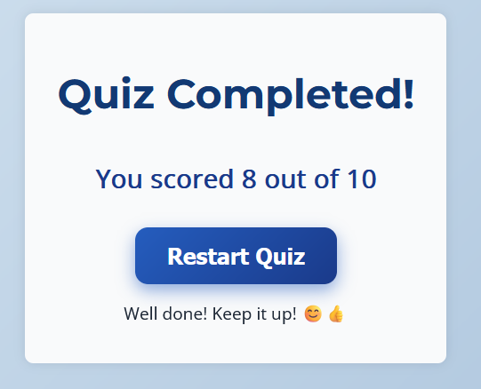

# 🧠 Quiz App

An interactive quiz application with multiple categories, real-time timer, leaderboard tracking, and a smooth restart experience. Built using **React.js** (frontend) and **Node.js/Express** (backend).

---

## 🖼️ App Preview

| Welcome Screen | Quiz In Progress |
|----------------|------------------|
|  |  |

| Result Page | Leaderboard |
|--------------|-------------|
|  |  |

---

## 🚀 Features

- 📚 **Multiple Quiz Categories** (e.g., General Knowledge, Science, Computers, etc.)
- ⏱️ **Timer-based** quiz functionality
- 🔁 **Restart Quiz** button resets everything
- 📊 **Leaderboard** to track performance
- 🖥️ **Responsive and visually appealing UI**

---

## 🧠 How it Works

1. 📁 Questions are fetched from the backend (`questions.json`) or from a quiz API.
2. 🧮 Quiz logic handles score tracking, question progression, and countdown timer.
3. 🏁 At the end of the quiz, the score and leaderboard are shown.
4. 🔄 User can restart the quiz from the beginning with a single button.

--- 
## Project Structure

QuizApp/
├── backend/
├── frontend/
├── screenshots/
│ ├── welcome.png
│ ├── quiz.png
│ ├── quiz1.png
│ └── complete.png
├── README.md


## 🌐 Technologies Used
- **Frontend**: React.js, CSS
- **Backend**: Node.js, Express.js
- **Data**: JSON or Open Trivia API
- **State Management**: React Hooks

*Note: The project is complete with all core features implemented.*

## 👩‍💻 Author
**Shivanee Rao**  
🎓 B.Tech at KIIT University  
💻 Frontend Developer  
🔗 [GitHub](https://github.com/Shivanee11)

### 1. Clone the repository
```bash
git clone https://github.com/Shivanee11/QuizApp.git
